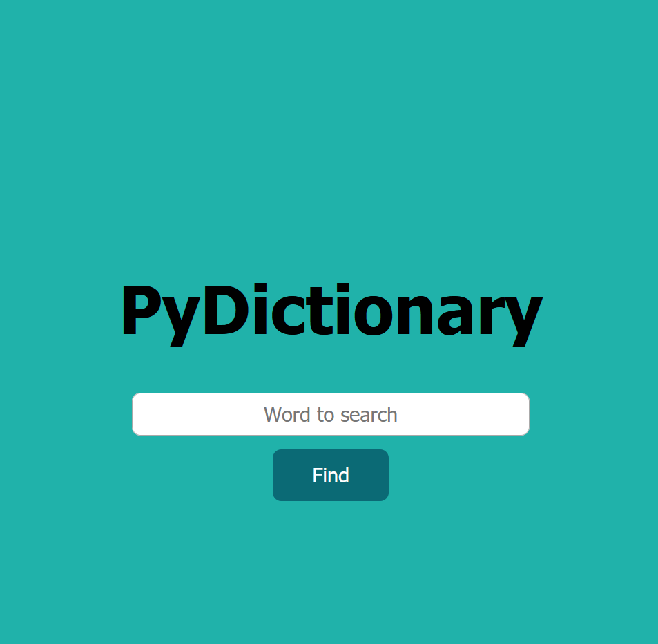
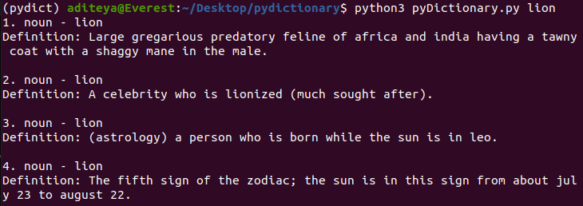
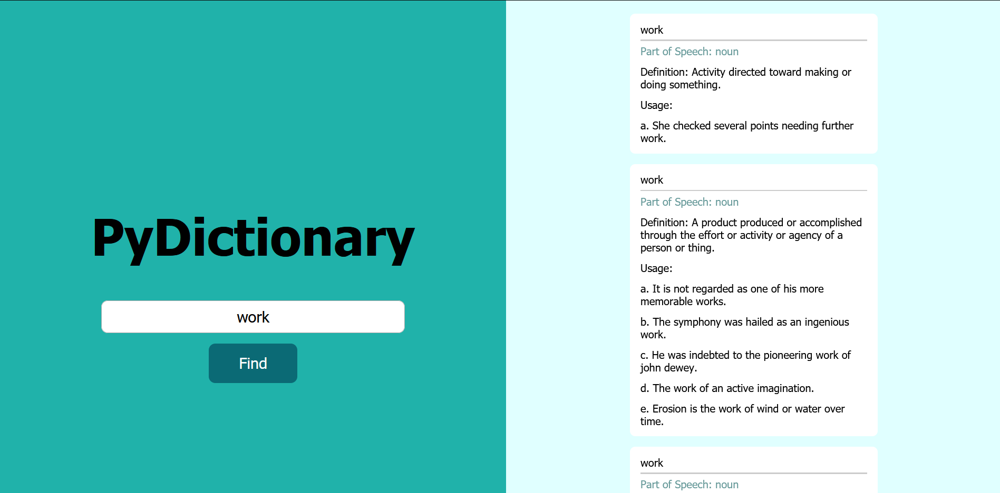

# PyDictionary

PyDictionary is an offline English dictionary made using Python along with the Wordnet Lexical Database and Enchant Spell Dictionary. The project is a very simple one made to understand the complete functionality of Wordnet and to test the extent of its resources. The application returns any query with a list of results - the various word forms and their meanings along with a sample sentence using the given word.

PyDictionary is a complete project, and can be used as a full fledged offline English dictionary. Although limited, it does the same job Google search does when searched with a word.

[Click here to visit PyDictionary!](https://python-dictionary.herokuapp.com/)



# Setting Up Environment

1. Create and activate virtual environment

```bash
python -m venv env
source env/bin/activate
```

2. Install dependencies

```bash
pip install -r requirements.txt
```

3. Install dev dependencies for code linting

```bash
pip install -r requirements-dev.txt
```

# How to run PyDictionary

## Runing on Command Line

Run the application by passing the search word as an argument.

```bash
python3 pyDictionary.py hello
```


## Running Flask App
```bash
flask run
```

